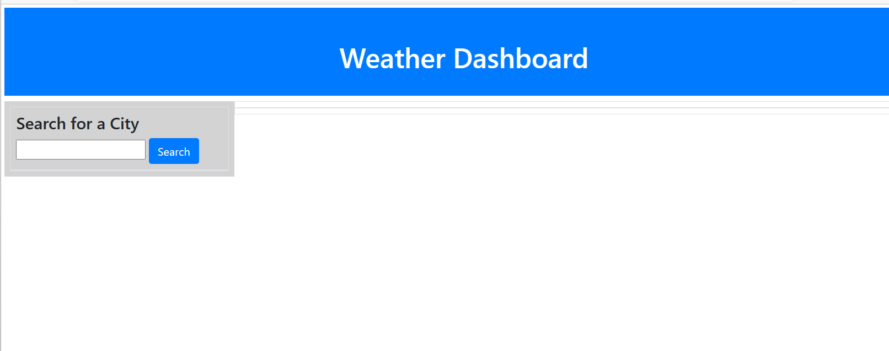

# MAUGB-M6C-Server-Side-API-Weather-Dashboard
Weather Dashboard- 5 Day Weather forecast -Third Party API

## Description

This application allows the user to consult the actual weather and weather forecast for the next 5 days.

The application was created using HTML, JavaScript, CSS, Bootstrap, jQuery and API Server side application from Open Weather Map API.

To run this application the user ser needs to provide the city name which is interested to know the weather conditions.
Once the city name is input then the application will connect with server API Weather channel to bring the necessary data to populate the climate related information.

On the display section for the actual day temperature, wind and humidity will be displayed.
For the upcoming 5 consecutive days the application will display the information as a card for each day, information will be temperature, wind and humidity.

The application is requesting weather data from the external API server side and request weather data to run the program.

## Table of Contents (Optional)

- [Installation](#installation)
- [Usage](#usage)
- [Credits](#credits)
- [License](#license)

## Installation

5-day weather dashboard
Application run on browser, there is not need from user to download the application to a local folder.

Access Links:

Weather Dashboard- 5 Day Weather forecas  Web deployment link access:

https://mauriciogb1.github.io/MAUGB-M6C-Server-Side-API-Weather-Dashboard/

Link to GitHub application depository:

https://github.com/MauricioGB1/MAUGB-M6C-Server-Side-API-Weather-Dashboard

## Usage

On the label input section city input is required, if the user skips to enter the city, then the application will send an alert that city is required.
After entering the city then click the search button and then the information request will be processed.

The actual day weather and forecast for the 5 upcoming days will be displayed on the section assigned as main container.

If a user wants to check the temperature for another city, then just needs to enter the new city on the input section and push the button to trigger the application and upload the weather data for that additional city. Weather information will be temperature, humidity and wind speed.

The selected cities will be kept on the local storage. 
The user can keep consulting additional cities and the names will remain on the left side as a list so they can be reused and consulted again in a different time without need to type again this specific city.

## Credits

Special Thank you to the coding boot camp from Rice University for the support provided.

API Open Weather API 5 days forecast
https://openweathermap.org/forecast5

## License

This application runs under MIT license.

